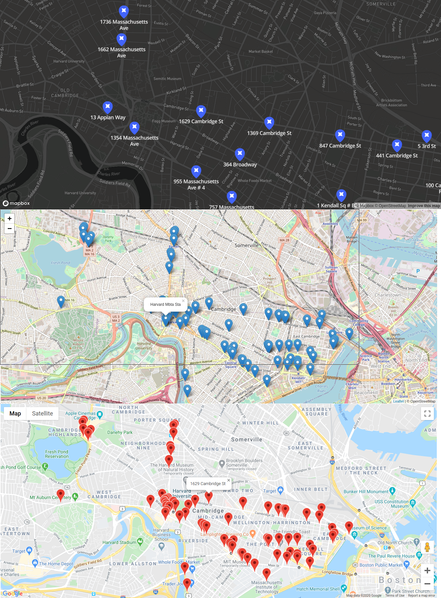

## PostgREST PostGIS example

### Requirements

- [PostgREST geojson branch](https://github.com/steve-chavez/postgrest/tree/geojson)
- PostGIS >= 3.0.0
- API Keys for Google Maps and Mapbox GL JS
- `psql -f init.sql`

### Screenshot

