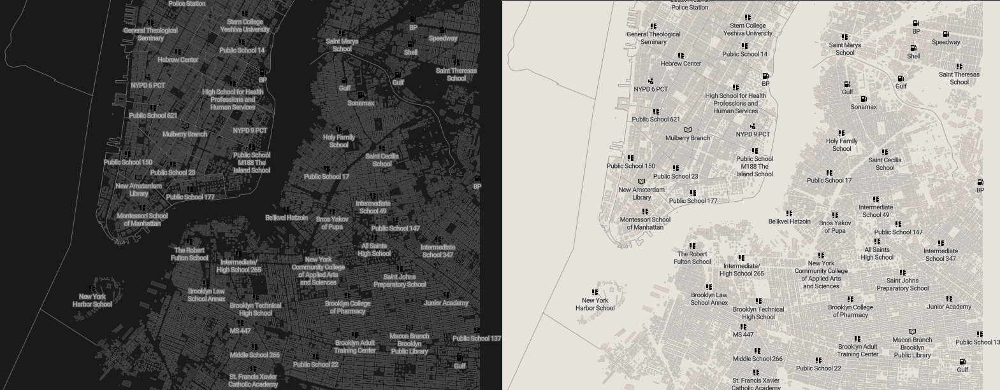

## PostgREST PostGIS example

### Requirements

- [PostgREST geojson branch](https://github.com/steve-chavez/postgrest/tree/geojson)
- PostGIS >= 3.0.0
- API Keys for Google Maps and Mapbox GL JS
- `psql -f init.sql`
- `nginx -p nginx`
- For OSM mvt, `cd osm` and:
  + `wget http://download.geofabrik.de/north-america/us/new-york.html`
  + Download https://github.com/omniscale/imposm3.
  + `imposm import -mapping mapping.json -read new-york-latest.osm.pbf -overwritecache -write connection '<pgurl>'`
  + bash tiles.sh

### Geojson screenshot

### MVT

### OSM MVT

